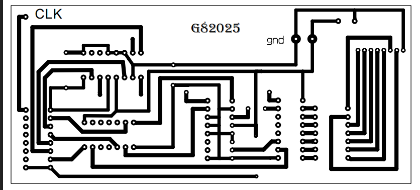

# UNIVERSIDAD DE SAN CARLOS DE GUATEMALA  
## FACULTAD DE INGENIERÍA  
### ESCUELA DE CIENCIAS Y SISTEMAS  
#### ORGANIZACIÓN COMPUTACIONAL  

---

  

<h1 align="center">TIKALPARK</h1>
<h2 align="center">PRÁCTICA #3</h2>

---

### Integrantes del Grupo

| Nombre |Carnet|Trabajado|  
|--|--|--|
| **201900532** | Juan José Gerardi Hernández | *20%*
| **202209714** | Ángel Enrique Alvarado Ruiz | *20%*
| **202300848** | Brayan Emanuel García | *20%*
| **202300824** | Alexander Samuel Us Upún | *20%*
| **202300768** | Norma Elizabeth Canú Xico | *20%*

---

## Introducción

La presente práctica forma parte del curso de **Organización Computacional**, orientada a aplicar de manera práctica los conceptos de lógica combinacional y secuencial. Se desarrolla un prototipo funcional de una torre de parqueo inteligente, denominada **TikalPark**, inspirada en las instalaciones del hotel "Grand Tikal Futura".

Este sistema automatizado simula una torre de parqueo de tres niveles, implementando sensores, servomecanismos, y elementos digitales para controlar el ingreso, salida y conteo de vehículos. Además, se incorpora un mecanismo de seguridad que previene accesos no autorizados.

Para su desarrollo, se emplearon circuitos digitales utilizando compuertas lógicas, flip-flops, contadores y otros componentes, evitando el uso de microcontroladores en áreas específicas, según los requerimientos. No obstante, se hace uso del **Arduino** en las partes correspondientes al control de garitas, sensores de proximidad y servomotores.

Este documento describe a detalle el planteamiento del problema, el análisis lógico, los esquemas de diseño, así como los resultados obtenidos en simulación y la implementación física del proyecto.

---

##  OBJETIVOS

### Objetivo General  
- Aplicar los conocimientos teóricos adquiridos en clase magistral y laboratorio para la construcción de circuitos combinacionales y secuenciales mediante un sistema de parqueo automatizado.

### Objetivos Específicos

1. Desarrollar un sistema que integre lógica combinacional con lógica secuencial.
2. Aplicar Mapas de Karnaugh para la optimización de funciones lógicas.
3. Comprender y emplear el funcionamiento de distintos elementos electromecánicos.
4. Familiarizarse con el uso de microcontroladores en sistemas digitales.
5. Diseñar un sistema eficiente, utilizando la menor cantidad posible de componentes.
6. Resolver problemas prácticos empleando principios de electrónica digital.
7. Identificar aplicaciones prácticas de la lógica secuencial en sistemas de control.

--## Proceso Teórico

Para el desarrollo de la lógica secuencial del sistema de parqueo automatizado **TikalPark**, se hace uso del circuito integrado **74LS107**, un componente esencial que contiene dos flip-flops tipo JK con entradas de control específicas. Este dispositivo permite almacenar y controlar estados dentro del sistema digital, fundamental para la gestión del conteo de vehículos y el control de la lógica secuencial en general.

###  Características principales del 74LS107

- **Flip-flop JK dual**: Integra dos flip-flops JK independientes dentro de un solo encapsulado.
- **Entrada de clear asincrónico**: Permite reiniciar (poner en 0) la salida sin depender del reloj ni de las entradas J y K.
- **Entradas J y K**: Determinan el comportamiento del flip-flop en cada ciclo de reloj.
- **Entrada de reloj (CLK)**: Sincroniza los cambios de estado en la salida del flip-flop.

###  Funcionamiento del Flip-Flop JK

El comportamiento del flip-flop JK depende de las combinaciones de las entradas **J**, **K** y del pulso de reloj:

| J | K | Acción                         |
|---|---|--------------------------------|
| 0 | 0 | Mantiene el estado anterior    |
| 0 | 1 | Reinicia la salida a 0         |
| 1 | 0 | Establece la salida a 1        |
| 1 | 1 | Invierte el estado actual (toggle) |

Además, el 74LS107 responde a **flancos de bajada** del reloj (borde negativo), lo cual es importante para el diseño sincronizado del sistema.

###  Aplicación en el proyecto

El uso del 74LS107 es clave para implementar los **contadores ascendentes y descendentes** necesarios en el sistema de parqueo. Estos contadores controlan:

- El número de vehículos dentro del parqueo.
- La cantidad de espacios disponibles en cada nivel.
- El control de avance entre niveles cuando uno se encuentra lleno.

Debido a las restricciones del proyecto, esta lógica fue implementada **sin Arduino**, utilizando únicamente lógica secuencial pura mediante **flip-flops**, asegurando una solución digital discreta adecuada al objetivo pedagógico de la práctica.

---
### Diagramas
Contadores

  

  

Puente H
Placa

  

Simulación

  

### Equipo utilizado

  

  

  

### Presupuesto

  

### Conclusiones

